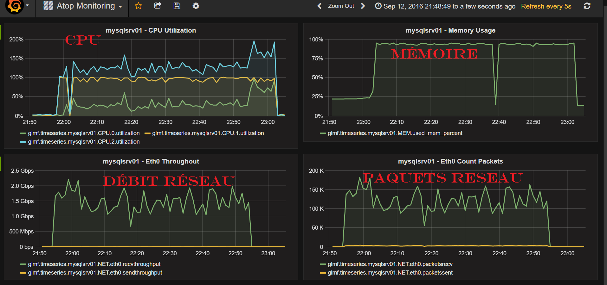

# Overview
This tool provides a collection of scripts that enable to extract raw counters from [atop](http://www.atoptool.nl/), 
aggregate them to generate high level performance metrics, which are then injected into a [Graphite](https://graphiteapp.org/) database 
to be finally visualized through the Graphite Web UI, or even better, through [Grafana](http://grafana.org/), the widely-used  open source visualization tool.



# Before you start
You will need to have:
* A working Graphite installation.
  And specifically, the Carbon Cache Daemon (carbon-cache.py) should be reachable through the following environement variables:
  * `CARBON_CACHE_SERVER`: should be set with the IP address or the hostname of the server hosting Carbon Cache.
  * `CARBON_CACHE_PICKLE_PORT`: should be set with the port of the pickle receiver of Carbon Cache.
* A working Grafana installation, if you want to use Grafana instead of the native Graphine UI, for the visualization

# Getting Started Collecting Metrics
Log in to the machine where you want to collect performance metrics and run the following command:
```
$ atop -P NET,MEM,CPU,cpu | \
       collect_atop_counters.sh | \
       push_graphite_formatted_data_live.py
```

Currently collected counters are related to network, memory and CPU are resources and the aggregated metrics are:
* CPU Usage: system-wide and per core.
* Memory Usage: system-wide.
* Network Bandwidth: send/receive, system-wide and per interface.  
* Network Packets: send/receive, system-wide and per interface. 

By default atop counters are collected every second.
You can change this interval by setting the environment variable ` ATOP_UPDATE_INTERVAL5 ` with another duration in seconds. 

For example to change the interval to 5 seconds, you can use the following command:
```
$ ATOP_UPDATE_INTERVAL=5 \
       atop -P NET,MEM,CPU,cpu | \
       collect_atop_counters.sh | \
       push_graphite_formatted_data_live.py
```

Then go to the next step to learn who to visualize collected metrics.

# Dashboard & Metric Visualization
The collected metrics can be visualized through Graphite Web UI out-of-the-box. 

You can also use Grafana for the visualization by proceeding as follows:
* Log into Grafana
* If not yet the case, configure your Graphite installation as data source.
* Download and import [this dashboard template](https://grafana.com/dashboards/465) which is already configured to enable the visualization of the collected metrics out-of-the-box.
* Open the dashboard and enjoy!

# Copyrights
This project bas been initiated by Rodrigue Chakode, who also created [RealOpInsight](http://realopinsight.com).

The software is licensed under the terms of Apache 2.0 License.

Please note that Graphite and Grafana are third-party systems with their respective licenses and terms of use.

# Contributions
Contributions are welcome!
* Give a feedback, report a problem, or give a star are good starting points to start contributing. 
* You can also contribute bug patches or new features. In this case, please can use the Github Pull Request model. It is assumed that code and documentation are contributed under the Apache License 2.0.
